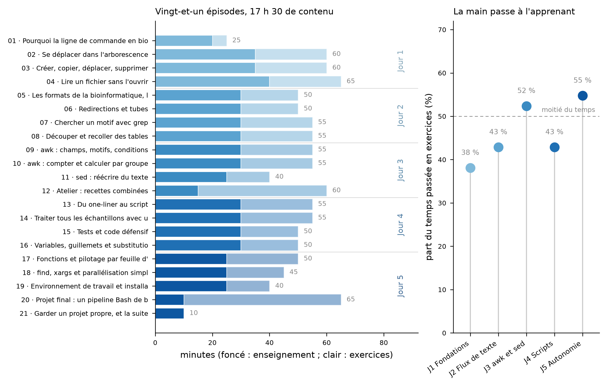

# Bash pour la bioinformatique — formation de 20 heures, en français

Leçon [Carpentries Workbench](https://carpentries.github.io/workbench/) destinée
à des biologistes qui n'ont jamais ouvert un terminal, et qui doivent pouvoir,
au bout de cinq demi-journées, traiter leurs propres fichiers de séquençage en
ligne de commande sans dépendre de quiconque.

- **Format** : 5 demi-journées de 4 h (17 h 30 de contenu, 20 h de présence
  pauses comprises).
- **Public** : débutants complets. Aucun prérequis, aucun accès serveur : tout
  se fait sur le portable de l'apprenant, sous Linux, macOS ou Windows (WSL 2).
- **Langue** : français. Les noms de commandes, d'options et de formats restent
  en anglais, comme dans la vraie vie.
- **Contenu** : navigation, manipulation de fichiers, formats de la
  bioinformatique (FASTA, FASTQ, GFF3, BED, VCF, SAM, TSV), redirections et
  tubes, `grep`, `cut`/`sort`/`uniq`/`join`/`paste`, `awk`, `sed`, scripts,
  boucles, tests, fonctions, `find`/`xargs`, environnement de travail, puis un
  projet final complet.



Cette leçon est le **premier volet** d'un ensemble de deux. Le second (conteneurs,
gestionnaires de flux de travail, Git, travail sur serveur, rapports
reproductibles) suppose celui-ci acquis.

## Contenu du dépôt

| Chemin | Contenu |
|---|---|
| `episodes/` | Les 21 épisodes, dans l'ordre d'enseignement |
| `learners/` | Installation, aide-mémoire, page de dépannage |
| `instructors/` | Notes formateurs, guide de style, fiche de faits sur les données |
| `profiles/` | Profils d'apprenants visés |
| `scripts/generer_donnees.py` | Génère le jeu de données synthétique |
| `scripts/verifier_episodes.py` | Réexécute tous les blocs de code des épisodes |
| `data/` | Jeu de données pédagogique (900 Kio, synthétique) |
| `plan_formation.csv` | Plan détaillé : objectifs, durées, notions par épisode |

## Le jeu de données

Entièrement **synthétique** : six échantillons d'ARN d'une bactérie fictive,
avec génome, annotation, lectures, alignements, variants, tables de comptage,
journaux de pipeline et un répertoire `brut_desordre/` aux noms de fichiers
volontairement pénibles (espaces, parenthèses, majuscules incohérentes). Aucune
donnée réelle, donc aucune restriction de diffusion, et des tailles choisies pour
que chaque commande réponde en moins d'une seconde sur un portable.

Régénérer les données, à l'identique (graine fixée) :

```bash
python3 scripts/generer_donnees.py
bash scripts/preparer_archive_donnees.sh   # produit donnees-formation-bash.tar.gz
```

## Tous les blocs de code sont testés

Chaque bloc `bash` des épisodes est réellement exécuté, dans l'ordre, dans un bac
à sable neuf ne contenant que `data/`, et sa sortie est comparée au bloc
`output` qui le suit dans la leçon :

```bash
python3 scripts/verifier_episodes.py --strict
```

C'est ce que fait la CI à chaque *pull request* (`.github/workflows/verifier-code.yaml`).
Un apprenant qui recopie une commande de la leçon obtient donc la sortie
annoncée. Les conventions de marquage (`<!-- verif: ... -->`) sont décrites dans
`instructors/guide-de-style.md`.

## Construire le site localement

```r
install.packages("sandpaper", repos = c("https://carpentries.r-universe.dev/",
                                        getOption("repos")))
sandpaper::serve()
```

Publication : `sh scripts/preparer_publication.sh COMPTE COURRIEL "Prénom Nom"`,
puis `git push`. Le workflow *01 Maintain: Build and Deploy Site* pousse le site
dans la branche orpheline `gh-pages`, que GitHub Pages doit servir
(**Settings → Pages → Deploy from a branch → `gh-pages` / root**). Marche à
suivre complète dans `instructors/publier.md`.
